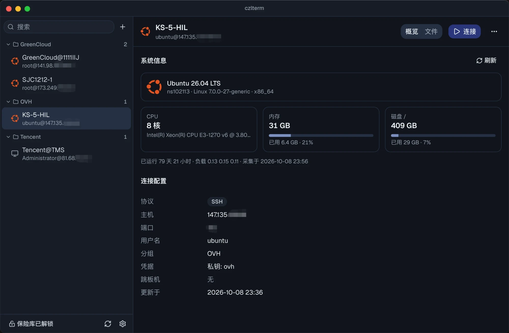
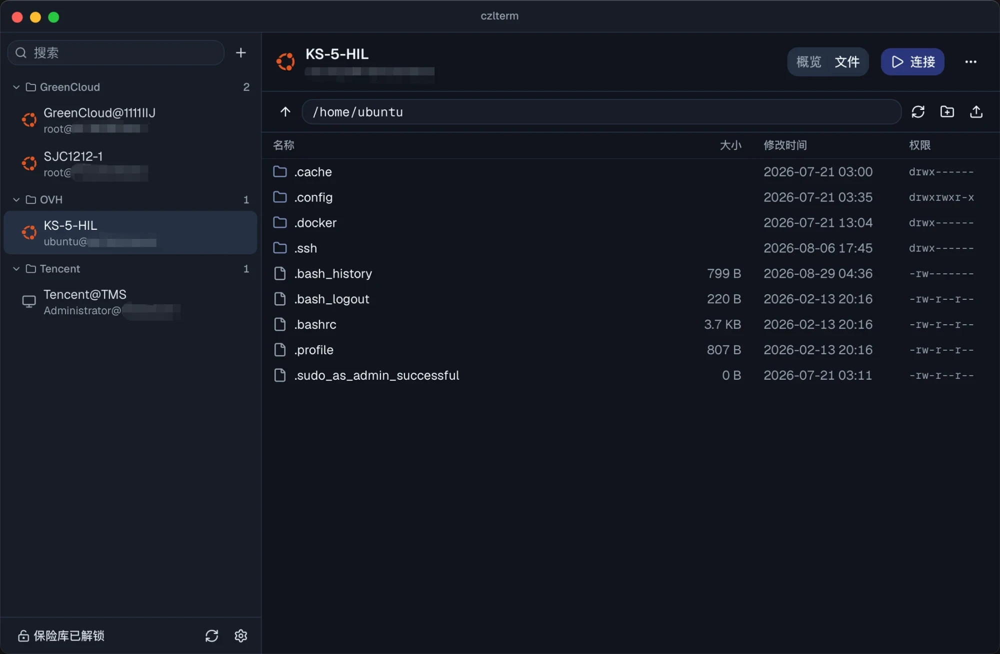
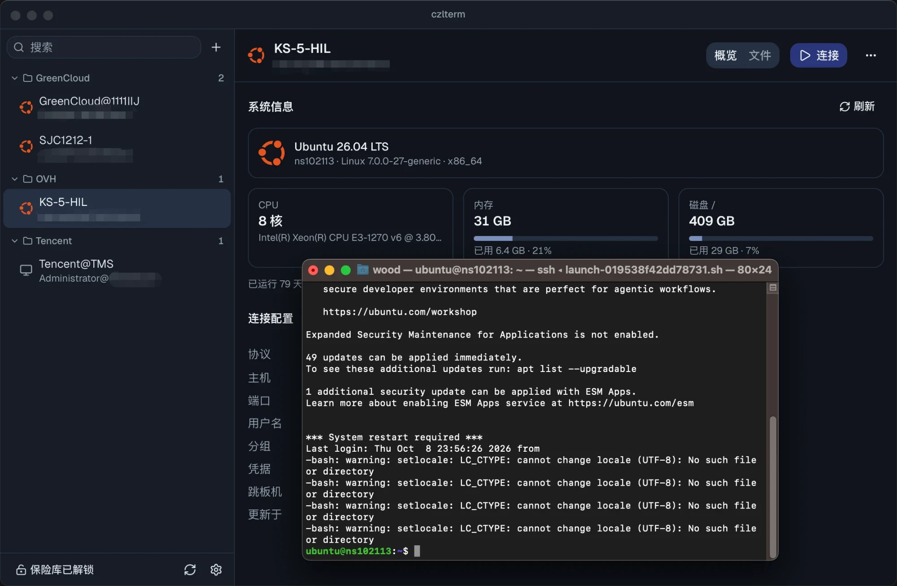
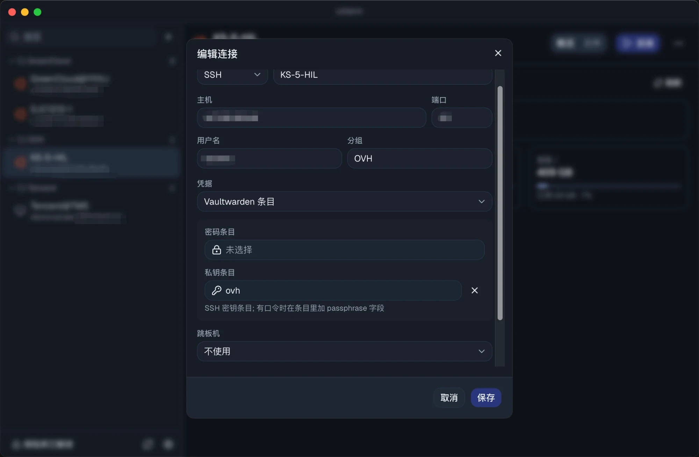
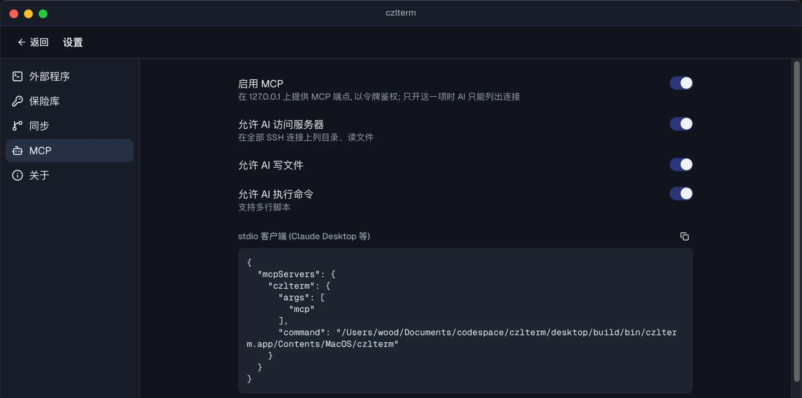
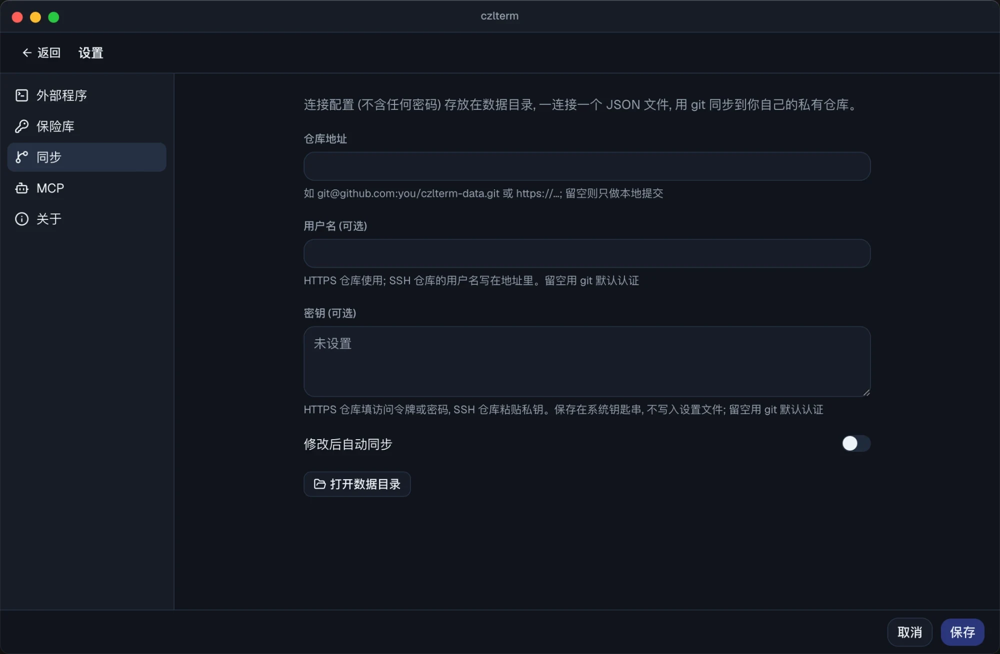
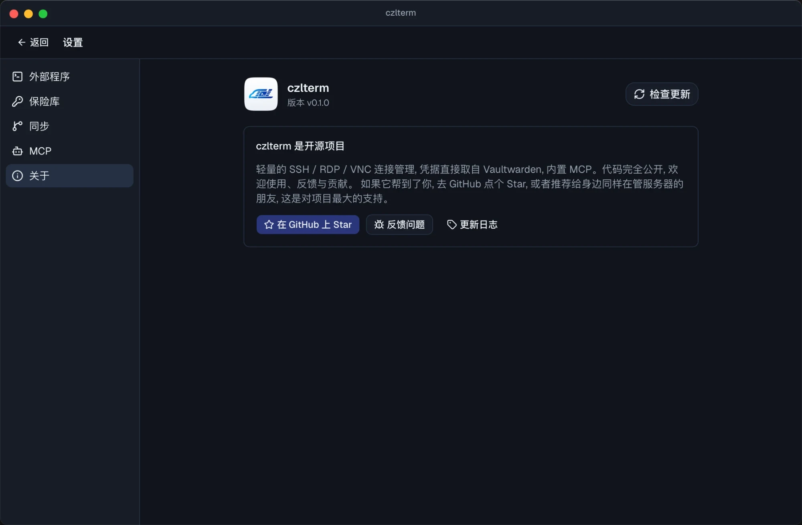

# czlterm

[English](README.md) | 简体中文

轻量的连接管理器。SSH、RDP、VNC 都交给系统自带或常用的客户端，czlterm 只负责管理连接、从 Vaultwarden 取凭据、管理远程文件，以及给 AI 提供 MCP 接口。

- **不内置终端和远程桌面**：SSH 在系统终端里打开（Terminal、iTerm2、Ghostty、WezTerm、kitty、Windows Terminal、PowerShell）；RDP 在 macOS 上用 Windows App，在 Windows 上用 mstsc；VNC 在 macOS 上用系统自带的屏幕共享，在 Windows 上用 TigerVNC
- **凭据来自 Vaultwarden**：通过官方 `bw` CLI 读取密码和 SSH 私钥，不写入磁盘
- **文件管理**：通过 SFTP 浏览、上传、下载、重命名、删除；双击文件会用 VS Code 等编辑器打开，保存后自动传回服务器
- **MCP**：AI 客户端可以列出连接，并在你授权的服务器上读写文件、执行命令
- **同步**：每个连接存成一个 JSON 文件（不含密码），通过 git 同步到你自己的私有仓库。可以单独设置用户名和密钥（HTTPS 填访问令牌，SSH 粘贴私钥，密钥存进系统钥匙串）；不设置就用 git 默认的认证
- **机器信息**：每次 SSH 连接后，在后台采集系统、内核、CPU、内存、磁盘和运行时长，显示在概览页；连接列表里显示对应的系统图标
- 基于 Go 和 Wails，界面用系统 WebView 渲染，不打包浏览器内核

## 截图



| | |
|---|---|
|  |  |
| SFTP 文件管理，双击用编辑器打开，保存后自动传回 | 连接时调起系统终端，私钥和密码由 czlterm 自动提供 |
|  |  |
| 凭据只引用 Vaultwarden 条目，配置里没有明文密码 | MCP 权限分级开关，支持多行脚本 |
|  |  |
| git 同步到自己的私有仓库，用户名和密钥可选 | 在线更新，下载后校验 SHA-256 |

## 凭据怎么传给外部程序

| 场景 | 方式 |
|---|---|
| SSH 私钥 | 解密后放进 czlterm 进程内为这个连接单独开的 ssh-agent 端点，通过 `SSH_AUTH_SOCK` 交给系统 ssh。跳板链上各跳的私钥放在同一个端点里 |
| SSH 密码 | 通过 `SSH_ASKPASS` 回调 czlterm，凭一次性令牌取密码。主机指纹确认、两步验证码等其它提示仍在终端里由你自己回答 |
| RDP（Windows） | 临时写入凭据管理器 `TERMSRV/<host>`，2 分钟后还原：原来存过这台主机的凭据就写回去，没有就删除 |
| RDP（macOS） | Windows App 不接受外部传入的密码，所以把密码复制到剪贴板，45 秒后清除 |
| VNC（macOS） | 用 `vnc://` 链接打开屏幕共享。密码不放进链接（链接是命令行参数，同机其他用户能看到），而是复制到剪贴板，45 秒后清除 |
| VNC（Windows） | 给 TigerVNC 生成 `-passwd` 文件，2 分钟后删除；其它查看器改用剪贴板 |

保险库锁定（手动锁定或空闲超时）或退出程序时，agent 端点、进程内的 SSH 连接和 bw 会话都会被清除。

可以在「设置 → 保险库」里打开「记住解锁」：bw 会话密钥存进系统钥匙串，重启 czlterm 不用再输主密码。手动锁定或空闲超时锁定时会一并删除。

## 安装

从 [Releases](https://github.com/woodchen-ink/czlterm/releases) 下载：

- **Windows**：`czlterm-amd64-installer.exe`，按用户安装到 `%LOCALAPPDATA%\CZL\czlterm`，不需要管理员权限
- **macOS**：`czlterm-darwin-universal.dmg`，Intel 和 Apple Silicon 通用。应用没有 Apple 开发者签名，第一次打开如果提示"已损坏"，执行一次：
  ```bash
  xattr -dr com.apple.quarantine /Applications/czlterm.app
  ```

介绍与讨论：[SunAI 论坛帖](https://www.sunai.net/t/topic/1533)

## 前置条件

- `bw` CLI，并在终端里登录过一次：
  ```bash
  npm i -g @bitwarden/cli
  bw config server https://你的-vaultwarden
  bw login
  ```
  之后在 czlterm 里输入主密码解锁即可
- 私钥存成 Bitwarden 的「SSH 密钥」条目。如果私钥有口令，在条目里加一个名为 `passphrase` 的自定义字段
- OpenSSH 8.4 或更高版本（`SSH_ASKPASS_REQUIRE` 从这个版本开始支持）。Windows 10 自带的 OpenSSH 是 8.1，需要升级：`winget install Microsoft.OpenSSH.Preview`
- 同步功能需要系统已安装 git，并已配置好访问仓库的认证

## MCP

在「设置 → MCP」里启用，然后复制配置片段：

- stdio 客户端（如 Claude Desktop）：`czlterm mcp`
- HTTP 客户端（如 Claude Code）：`http://127.0.0.1:47840/mcp`，用 Bearer 令牌鉴权

| 工具 | 说明 | 需要的权限 |
|---|---|---|
| `list_connections` | 列出连接，不含凭据 | 启用 MCP |
| `list_files` / `read_file` | 读目录和文件 | 设置里的「允许 AI 访问服务器」 |
| `write_file` | 写文件 | 上一项，再加设置里的「允许 AI 写文件」 |
| `run_command` | 执行命令或多行脚本（经标准输入交给 `sh`，也可选 bash、zsh、powershell，可指定工作目录） | 上上项，再加设置里的「允许 AI 执行命令」 |

## 在线更新

启动 30 秒后检查一次，之后每 6 小时检查一次 GitHub Releases。发现新版本后侧栏会提示，也可以在「设置 → 关于」里一键更新。安装包下载后先按 `SHA256SUMS` 校验，通过才会安装。

## 数据位置

| 系统 | 路径 |
|---|---|
| macOS | `~/Library/Application Support/CZL/czlterm/` |
| Windows | `%LOCALAPPDATA%\CZL\czlterm\` |

子目录：`config/` 放本机设置，`data/` 放连接配置（这是一个 git 仓库），`logs/` 放日志，`cache/` 放临时文件。

## 构建

```bash
go install github.com/wailsapp/wails/v2/cmd/wails@v2.12.0
cd desktop && wails build
```

Windows 安装包：`.\build.ps1`（需要 NSIS）。推送 `v*` 标签后，GitHub Actions 会构建 Windows 安装包和 macOS DMG 并发布到 Releases。

## 许可证

[AGPL-3.0](LICENSE)
